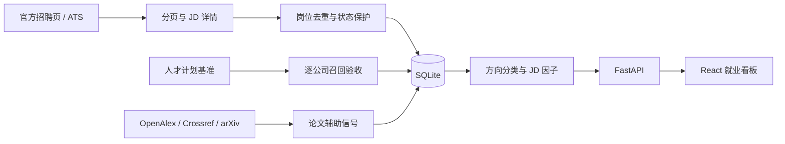

<div align="center">


# AI Career Radar

### AI 就业雷达

用真实岗位、人才计划和 JD 因子判断 AI 方向的就业性价比。

[](https://www.python.org/)
[](https://fastapi.tiangolo.com/)
[](https://react.dev/)
[](https://www.sqlite.org/)
[](#验证)

</div>

---

## 项目定位

AI Career Radar 是一个本地优先、证据可追溯的个人就业决策看板。它首先回答：

- 哪些 AI 方向的**岗位更多**？
- 大厂专项人才计划正在把名额投向哪里？
- JD 里真正高频的技术和候选人要求是什么？
- 结合个人研究能力与工程短板，哪个方向更值得投入？

论文数据只用于辅助观察方向热度，不替代岗位需求。本项目不会把岗位广告数说成录用人数，不会把抓取失败填成零，也不会在历史不足时制造增长曲线。

## 核心页面

| 页面 | 主要用途 |
| --- | --- |
| 方向选择 | 比较人才计划岗位、当前在招、研究热度与个人进入难度 |
| 人才计划与因子 | 查看专项计划覆盖，以及 JD 技术押注、要求与因子共现 |
| 方向详情 | 查看岗位证据、论文辅助趋势和低置信度预测 |
| 岗位列表 | 搜索具体岗位，筛选公司、城市、学历、经验和招聘类型 |
| 抓取进度 | 审计每个来源的完整性、候选量、实际抓取量与错误 |

方向性价比指数（DVI）默认强调就业需求：

```text
DVI = 50% 岗位数量 + 20% 研究热度 + 30% 低个人困难度
```

其中岗位分以专项人才计划为主；所有原始数量与分项得分都会保留。论文样本不完整时，研究热度按覆盖置信度自动降权。

## 数据流水线



### 岗位采集

- 支持 Greenhouse、Lever 公开接口，以及腾讯青云、阿里校招、蚂蚁 Plan A、蚂蚁研究实习、美团北斗、百度 AIDU、字节前沿技术、快手快Star 等官网来源。
- 分页来源按官网 `total` / `totalPage` 遍历；详情请求采用有限并发和本地缓存。
- 去重键为 `来源命名空间 + 公司 + 官方岗位 ID`。
- 若一次扫描相对最近完整扫描骤降超过 50%，自动标记为 `partial`，不会误关旧岗位。
- 可导入外部人才计划 JSONL 作为隔离验收快照；参考岗位不会冒充当前在招。
- 薪资保留招聘原文，并按带日期的参考汇率统一换算成人民币。

### JD 因子

系统从岗位标题、职责和要求中分别提取：

- 技术押注：大模型、多模态、Agent、强化学习、AI Infra 等。
- 候选人要求：博士、顶会、部署、开源、Python/C++、PyTorch 等。
- 因子共现：哪些技术方向常与哪些能力要求一起出现。

这些指标表示 JD 文本频率，不被解释为因果关系或录用人数。

### 研究辅助数据

- 配置 API Key 时使用 OpenAlex，按最近 5 年逐年、游标分页。
- 未配置 OpenAlex Key 时自动切换到 Crossref 公共索引。
- arXiv 分类 RSS 补充近期预印本。
- 优先按 DOI、OpenAlex ID、arXiv ID 去重；标题与年份仅在标识不冲突时辅助合并。
- 每批保存候选量、抓取量、相关量、页数、覆盖率、状态与错误。

## 快速开始

需要 Python 3.12+、[uv](https://docs.astral.sh/uv/) 和 Node.js 20+。

```bash
git clone https://github.com/Haoyu-Gu/ai-career-radar.git
cd ai-career-radar
./scripts/start.sh
```

打开 [http://127.0.0.1:8787](http://127.0.0.1:8787)。服务默认只监听本机。

首次运行后，可在“抓取进度”点击 **刷新真实数据**，或执行：

```bash
./scripts/update.sh
```

服务默认每 24 小时自动检查一次；数据库、缓存和原始响应均保存在本地。

## 配置

```bash
cp .env.example .env
```

| 环境变量 | 必需 | 用途 |
| --- | --- | --- |
| `OPENALEX_API_KEY` | 否 | 启用 OpenAlex；未配置时使用 Crossref |
| `OPENAI_API_KEY` | 否 | 启用可选证据摘要；未配置时使用规则摘要 |
| `OPENAI_BASE_URL` | 否 | OpenAI-compatible API 地址 |
| `OPENAI_MODEL` | 否 | 摘要模型名称 |
| `AUTO_REFRESH_HOURS` | 否 | 自动刷新间隔，默认 24 小时 |
| `OPENALEX_MAX_PER_DIRECTION` | 否 | 每方向 OpenAlex 抓取上限 |
| `CROSSREF_MAX_PER_DIRECTION` | 否 | 每方向 Crossref 抓取上限 |

来源配置位于 `backend/config/sources.yaml`，方向规则位于 `backend/config/directions.yaml`，JD 因子位于 `backend/config/factors.yaml`。

## 常用命令

```bash
# 初始化数据库与配置
PYTHONPATH=backend uv run --frozen python -m app.cli init

# 只更新招聘 / 只更新论文
PYTHONPATH=backend uv run --frozen python -m app.cli jobs
PYTHONPATH=backend uv run --frozen python -m app.cli papers

# 导入人才计划验收基准，不计入当前在招
PYTHONPATH=backend uv run --frozen python -m app.cli benchmark \
  --path /absolute/path/to/top_programs_all_core.jsonl
```

## 数据口径

> 本项目统计公开招聘广告和已处理论文记录，不是录用人数，也不是论文数据库全量普查。

- 首次完整岗位扫描是基线；只有后续观察才能称为新增或关闭。
- 只有完整扫描可以关闭未再次出现的岗位；部分、失败、受阻扫描不会关闭岗位。
- “人才计划岗位数”是岗位广告条数，不等于计划录用人数。
- 作者只对稳定身份 ID 去重；没有 ORCID 等标识的作者不会被冒充为唯一身份。
- 本工具不绕过登录、验证码、封禁或访问控制。

## 本地数据与隐私

以下内容默认不会提交到 Git：

```text
.env
data/*.db
data/raw/
data/cache/
```

仓库只保存采集器、配置模板、界面与测试代码。密钥不会写入前端、日志或原始记录。

## 验证

```bash
PYTHONPATH=backend uv run --frozen pytest -q
npm --prefix frontend run build
```

当前测试覆盖岗位与论文去重、分页、异常下降保护、人才计划基准隔离、JD 因子、薪资换算、预测门槛与方向价值计算。

## 技术栈

- **Backend** — FastAPI · httpx · SQLite · Pydantic
- **Frontend** — React · TypeScript · Vite · ECharts
- **Data** — YAML 配置 · JSONL 原始证据 · SQLite 本地分析库
- **Tooling** — uv · pytest · npm

---

<div align="center">
  <sub>Built and maintained by <a href="https://github.com/Haoyu-Gu">Haoyu Gu</a>.</sub>
</div>
